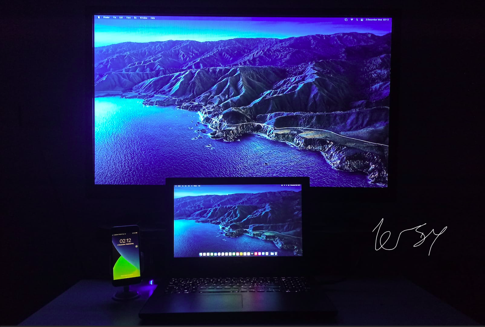

Prebuilt EFI folders for Dell Inspiron 7577 to make it bootable with macOS through OpenCore boot loader.

I can install, update and upgrade macOS on my laptop with this folder yet it is not guaranteed that it will work for you as well. Even though they are same models, two computers can have differences. Proceed all processes at your own risk. 

Do not use prebuilt EFI folders before you read this page otherwise it will end up with a failure.

<b>#*Check releases tab for downloadable zip files*#</b> 
> Release cycle note: I plan to release a version on first tuesday of each month. I am out of new customizations ideas for my daily usage and they will be mostly based on updating opencore base and kexts. FYI

<b>Specifacations</b>

* Intel i7-7700HQ CPU
* Intel HD Graphics 630 / Nvidia GTX 1050 Ti
* 16GB 2400MHz DDR4 RAM
* 15.6” 1080p IPS Display
* 128GB Samsung M.2 SSD (SATA) / 256GB Samsung 860 Evo SSD 
* Intel Dual Band WiFi 8265 & Bluetooth

> Specifications Note: As of December 2020 Prebuilt EFI, I stopped providing general EFI folder for a wider target. From this date onward, EFI folder will be targeting completely identical builds for best performance and convenience. It may be working with different models but even the same model is not quaranteed. For Dell 7577 with i5 & GTX 1060 I recommend you to check [wadimw's repo](https://github.com/wadimw/dell-7577-hackintosh) 

<b>General Known Problems</b>

* Nvidia 1050 Ti ( Optimus technology is not supported on macOS in fact Nvidia is not supported at all since Mojave )

* SDCard Reader ( I have no idea about it. I have never tried to make it work nor I have a plan to do so in the future. If you find a solution, please let me know. )

* 2.1 audio ( there is an id which enables subwoofer but I don't use it because the id I use in my config.plist has best compatibility with headphone. Detailed explanations about each id can be found at AppleALC manual page. The laptop has ALC256 on it. )

> Rest? Rest works for my usage ( Usb ports, direct HDMI, Wifi, Ethernet etc. etc. ) If you have identical model but non-working device, submit an issue.

| OS Version | EFI Version    | Known Problems related to version | Tested |
| ----------- | ------- | ---------- | ------------------- |
| macOS Big Sur  | December  | None except general          | Yes             |
| macOS Catalina  | December  | None except general          | No             |
| macOS Mojave  | December | None except general          | No              |
| macOS High Sierra   | December | None except general          | No              |

  
 To do list for not tested macOS versions 

  My prebuilt EFI folders are tested on macOS big sur only. To use it with previous macOS versions, you need to make following changes:
  
  * Download Airportitlwm.kext depending on your macos version and replace it with the one inside EFI>OC>Kexts ( See Acknowledgment section for link )
  
  * Set Misc>Security>SecureBootModel to j186 if you have early boot failures. It resembles Macbookpro15,1 which has a T2 chip on it. This quirk and SMBIOS model are not linked to each other so you do not have to change your SMBIOS to anything.
  

<b>CHAPTER I - BIOS version and options</b>

 

|||||    BIOS Version  ||||||    1.11.0    |||||

* Disable Secure Boot

* Change SATA operation to AHCI ( google it to learn more before you proceed this action if you use windows already to not lose your existed data on windows partition )

* Disable Virtualization

***Required advanced BIOS settings***

To enable advanced BIOS options, execute ModifiedGrubShell.efi at Opencore Picker Screen and enter given commands below for each settings.

| Command | Explanation    |
| ----------- | ------- |
| setup_var 0x4DE 0x00  | Disables CFG Lock	     |

This command disables CFG Lock which is a must to run macOS. 

| Command | Explanation   |
| ----------- | ------- |
| setup_var 0x889 0x00  | Disables WakeOnLan	     |

This command disables wake on lan BIOS settings so laptop can sleep on battery and AC without problem. Without disabling this setting, your laptop will have sleep issues on AC. On battery sleep works well because it is set to disable on battery by default. No mandatory to run macOS but advised for proper sleep and wake functions.  

Advanced BIOS settings note: 

*These values will be overwritten in case you update your bios or reset CMOS physically so you have to execute commands again. Best to check my BIOS version and commands here before updating it by yourself.

*Without disabling these options via code provided above, one can not use prebuilt EFI as it is from December 2020. See "CHAPTER II - Config" for workarounds.

<b> CHAPTER II - Config </b>

* Config file does not include SMBIOS parameters ( MLB, ROM, SystemSerialNumber and SystemUUID ) which is a must. One needs to provide own values. MacSerial by Acidanthera is a good way to obtain proper serial and motherboard serial numbers. UUID can be generated with terminal command “uuidgen”. Builtin ethernet, wifi or thunderbolt device MAC address can be used as ROM value. For working imessage and facetime all should be set in a sensible way and make sure that they are not used by someone else either hackintosh or real Mac. When you change a value ( SN, MLB, UUID or ROM ) you should change all other values to prevent apple servers being suspicious about your account. 
Tested SMBIOS models by me and returned zero errors as follow: Macbookpro14,1 ; Macbookpro14,2 ; Macbookpro 14,3. I highly recommend you to create Macbookpro14,3 SMBIOS parameters since it will be default from now on but it is totally up to your own liking

* If you do not want to execute disabling cfg lock command explained in CHAPTER - I, you have to set Kernel>Quirks>AppleXcpmCfgLock to YES

* To enable VT, Booter>Quirks>DevirtualiseMmio can be set to YES as a workaround

* You have to set UEFI>Audio>PlayChime to NO for disabling bootchime. (scary sound when you boot into OC ) 

* If you dual boot like me explained below in CHAPTER III, you can disable quirk Misc>Boot>ShowPicker. In this way, it will directly start booting macOS for you as a normal Mac without timeout phase.

<b> CHAPTER III - Dual Booting </b>

I have two seperate ssd drives listed above. Windows is installed to 256gb and Macos is installed to 128GB. I do not boot Windows10 through Opencore. Both ssd drives are partitioned GUID partition schema type and both use their own bootloader. You can make switch with F12 key when you see DELL logo on starts. I strictly do not recommend booting windows through OpenCore.

<b> Acknowledgment </b>

[Team Acidanthera](https://github.com/acidanthera) for OpenCore boot loader itself and AppleALC, Brightness Keys, Lilu, RealtekRTL8111, VirtualSMC and its plugins, VoodooPS2Controller and Whatevergreen kexts. 

[Team VoodooI2C](https://github.com/VoodooI2C/VoodooI2C) for VoodooI2C and VoodooI2CHID kexts.

[Team OpenIntelWireless](https://github.com/OpenIntelWireless) for Airportitlwm, IntelBluetooth firmware and  Injector kexts.

[Team Dortania](https://dortania.github.io) for CtlnaAHCIPort.kext

[Piker-Alpha](https://github.com/Piker-Alpha) for ssdtPRGen script

[Daliansky](https://github.com/Daliansky) for prebuilt cosmetic SSDTs ( DMAC, HRT, MCHC, MEM2, PMCR and SBUS )

[uzairblaoch](https://github.com/uzairblaoch) for providing information about enabling HDMI port directly

#################

Thanks everyone who helped me with patience and developers for maintaing kexts, drivers, scripts and patches.

This whole process is made because of fucking educational purposes. 
