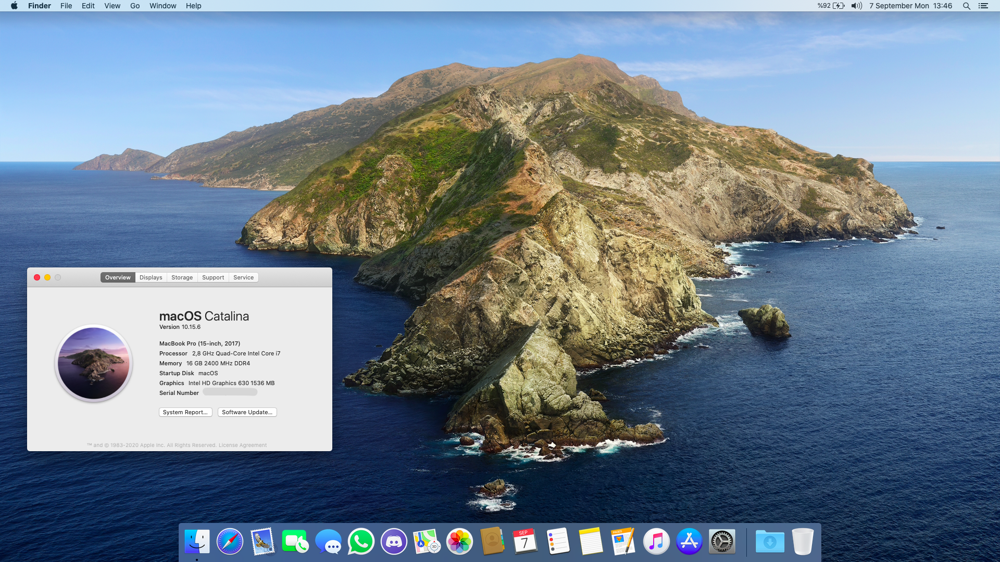

# Dell-7577-macOS-hackintosh-EFI-Files

An EFI folder for Dell Inspiron 7577 to make it bootable with macOS through OpenCore boot loader

I can install, update and upgrade macOS on my laptop with this folder yet it is not guaranteed that it will work for you as well. Even though they are same models, two computers can have differences. For similar laptops, this efi folder can be used as a base to build your own.

It is better to read OpenCore configuration.pdf file for detailed explanations. It may be the best documented piece of project across hackintoshing community. 

Another good source is dortania guide. It can be considered as a simple version of OpenCore configuration. At the same time it provides some tweaks which you can’t find on configuration.pdf file so definitely it is a good place to check out. 

I highly recommend you to read this page before using this efi folder.

<b>#*Check releases tab for downloadable zip files*#</b> 

<b>Specs</b>

* Intel i7-7700HQ CPU
* Intel HD Graphics 630 / nVidia GTX 1050 Ti
* 16GB 2400MHz DDR4 RAM
* 15.6” 1080p IPS Display
* 128GB Samsung M.2 SSD (SATA)/ 256GB Samsung 860 Evo SSD 
* Intel Dual Band WiFi - 8265

<b>Known Problems</b>

* SDCard Reader ( I have no idea about it. I have never tried to make it work nor I have a plan to do so in the future. If you find a solution, please let me know. )

* 2.1 audio ( there is an id which enables subwoofer but I don't use it because the id I use in my config.plist has better compatibility with headphone. Detailed explanations about each id can be found at AppleALC manual page. The laptop has ALC256 on it. )

* HDMI ( it doesn't work because it is connected to nvidia card which is disabled with a SSDT. Optimus technology is not supported in macos environment. There are workarounds for second display with thunderbolt however I have no idea about them because I do not have a device to check. If you have sufficient info and patches, please let me know. ) 

<b>BIOS Options and version</b>
* Current bios version is 1.11.0
* Disable Secure Boot
* Change SATA operation to AHCI ( google it to learn more before you proceed this action if you use windows already)

<b> Dual Booting </b>

I have two seperate ssd drives listed above. Windows is installed to 256gb and Macos is installed to 128GB. I do not boot Windows10 through Opencore. Both ssd drives are partitioned GUID partition schema type and both use their own bootloader. You can make switch with F12 key when you see DELL logo on starts. I strictly do not recommend booting windows through OpenCore. 

<b>Explanation of files in EFI/OC/ACPI folder</b>

Name | Explanation
---------|:---------
SSDT-ALS0 | Adding fake Ambient Light Device
SSDT-BRTK | Fixing F11 and F12 brightness keys	
SSDT-DGPU | Disabling Nvidia Card
SSDT-TPDX | Initializing touchpad in GPIO mode
SSDT-PLUG | Plug-in Type=1 (CPU )
SSDT-PNLF | Enabling backlight control
SSDT-XPRW | Prevent random wake ups on AC Power
SSDT-USBX | Power Management based on Macbook14,3 for USB ports

The SSDTs listed above are required for a smooth macOS experience. The SSDTs DMAC, MCHC, MEM2, SBUS are for only cosmetic purposes. They have no harm for anything so it is better to keep them.

<b> To Do List and Things to Consider </b>

* Config file does not include SMBIOS parameters which is a must. One needs to provide own values. There are guides here and there. Your friend is google as always. For ROM adress you can use your builtin ethernet card MAC adress. MacSerial by Acidanthera is a good way to obtain proper serial and motherboard serial numbers. UUID can be generated with terminal command uuidgen. Make it produced at least five times to be sure it is unique enough. For working imessage and facetime all should be set in a sensible way and make sure that they are not used by someone else either hackintosh or real mac.

* Thunderbolt Devices ( To enable Thunderbolt support, Smbios should be set to MacbookPro14,1. Since I have no thunderbolt device, I do not use this SMBIOS by default for better power management. But if you need to use thunderbolt devices, you can use Macbookpro14,1 SMBIOS and see notes below about the USBMap.kext Then it works with no further configuration. Courtesy of [@dbookuz](https://github.com/dbookuz) )

* USBMap.kext is set to Macbookpro14,3. If you want to use a different SMBIOS you should also change the correspond model name in the info.plist inside the kext. Fingerprint device is closed to save battery and avoid long waiting before root access. it does not work anyway for now because apple does not allow to use third party ones.

* CPUFriendDataProvider.kext is set to 800 mhz and 0x80 balance power.
 
* For voice over support you have to download audio files from [Team Acidanthera GitHub](https://github.com/acidanthera/OcBinaryData/tree/master/Resources) and place it in OC / Resources/Audio. You have to enable quirk UEFI>Audio>PlayChime for bootchime. 

* Misc>Security>Scan policy is set to “0” for displaying every possible drivers and operating systems. You can change it back to my preferred value ( 19858179 )  which excludes everything but macOS when you are done with your efi folder to scan safer.

* If you dual boot like me explained above, you can disable quirk Misc>Boot>ShowPicker. In this way, it will directly start booting macOS for you as a normal Mac after Dell logo.

* Stock WiFi ( there are two projects for enabling native wifi card on macOS as of date 09/2020.  One of them is named OpenIntelWireless project by [OpenIntelWireless team](https://github.com/OpenIntelWireless) and the other one is [Black80211-Catalina](https://github.com/usr-sse2/Black80211-Catalina) by usr-sse2. But keep that in mind that they are still under heavy development and you should follow instructions carefully on their respective GitHub pages. )

<b> To make a bootable usb stick please follow [Dortania creating the Usb instructions](https://dortania.github.io/OpenCore-Install-Guide/installer-guide/) depending on your current accessible OS. </b>

<b> CREDITS </b>

[Team Acidanthera](https://github.com/acidanthera) for OpenCore boot loader and AppleALC, CpuFriend, Lilu, RealtekRTL8111, VirtualSMC and its plugins, VoodooPS2Controller and Whatevergreen kexts. 

[Team VoodooI2C](https://github.com/VoodooI2C/VoodooI2C) for VoodooI2C and VoodooI2CHID kexts.

[Team OpenIntelWireless](https://github.com/OpenIntelWireless) for IntelBluetooth firmware and injector kexts.

[Corpnewt](https://github.com/corpnewt) for phyton script to build USBMap kext.

#################

Thanks to everyone who helped me with patience and developers for maintaing kexts, drivers, scripts and patches.

This whole process is made because of fucking educational purposes. 

 

